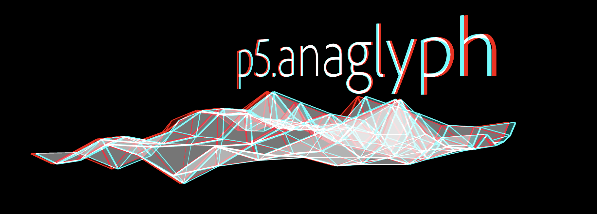

# p5.anaglyph

p5.anaglyph is a [p5.js](https://p5js.org/) library for creating 3D (anaglyph) scenes and images using red/cyan glasses. Uses [Dubois anaglyph algorithm](https://www.site.uottawa.ca/~edubois/anaglyph/) & color matrices.   
  
Created by [Jenna deBoisblanc](https://jdeboi.com/). 




## Examples
**NOTE** - for red/cyan glasses, the most common method is red on the left eye and blue on the right eye. 
* [basic demo](https://editor.p5js.org/jdeboi/sketches/vTjpXtNOL)  
* [terrain](https://editor.p5js.org/jdeboi/sketches/HBSn7y0rI)
* [tunnel](https://editor.p5js.org/jdeboi/sketches/sMKm31dQH)
* [text](https://jdeboi.com/p5.anaglyph/examples/text/)
* [anaglyph from stereo left/right images](https://jdeboi.com/p5.anaglyph/examples/stereo/)

## Sample Code

In the `index.html`:     
**NOTE** - there may be issues with caching and jsdelivr depending upon if I've made changes recently; if something breaks, you can find the library `p5.anaglyph.min.js` in the dist folder.
```html
<script src="https://cdn.jsdelivr.net/gh/jdeboi/p5.anaglyph/dist/p5.anaglyph.min.js"></script>
```

In the `sketch.js`:
```javascript
let anaglyph;

function setup() {
  createCanvas(windowWidth, windowHeight, WEBGL);
  
  anaglyph = createAnaglyph(this); 
}

function draw() {
  anaglyph.draw(scene);
}

// this is the logic of the scene
// all usual methods from draw(), but call on the 
// pGraphics parameter pg
function scene(pg) {
  pg.background(0);
  pg.fill(255);
  pg.rotateY(frameCount / 200);
  pg.box(200);
}
```


## Acknowledgments
Code adapted from:
* [Camera 3D Processing Library](https://github.com/hx2A/Camera3D)
* [three.js anaglyph effect](https://github.com/mrdoob/three.js/blob/d091564e0279adb607f9a2867fdd9f6dbfe10b2e/examples/jsm/effects/AnaglyphEffect.js)